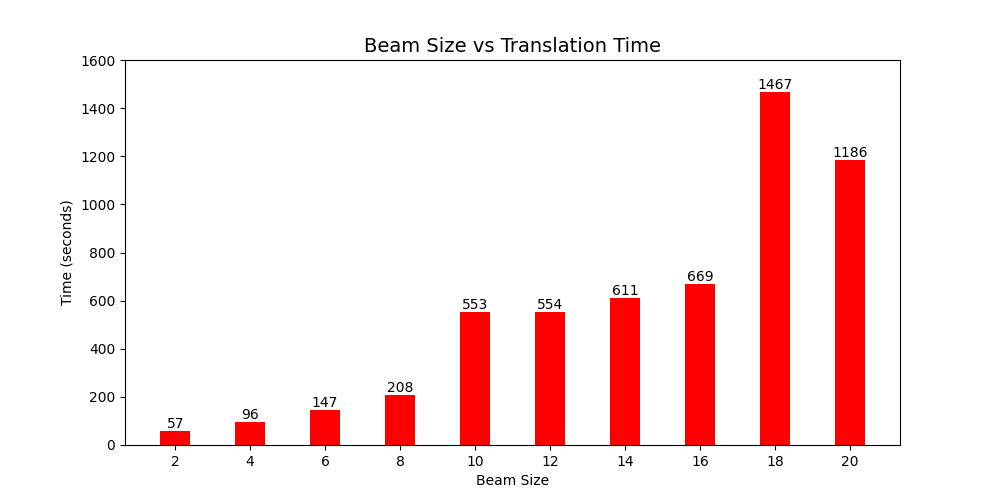
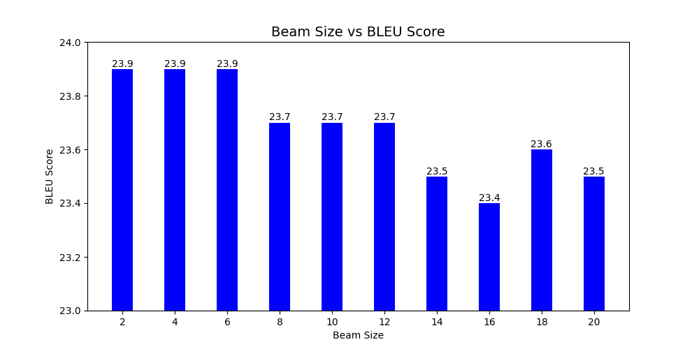

# MT Exercise 5: Byte Pair Encoding, Beam Search

This repo is a collection of scripts showing how our group members train the models and evaluate the results for MT exercise 5. 

## Group Members:

Mengjie Wu (22-747-869)
Ruomeng Xu (22-748-339)

## Requirements

- This only works on a Unix-like system, with bash available.
- Python 3 must be installed on your system, i.e. the command `python3` must be available
- Make sure virtualenv is installed on your system. To install, e.g.

    `pip install virtualenv`

## Task 1

Clone the fork of this repository in the desired place:

    git clone https://github.com/momoieaso/mt-exercise-5.git

    cd mt-exercise-5

Create a new virtualenv that uses Python 3.10. Please make sure to run this command outside of any virtual Python environment:

    ./scripts/make_virtualenv.sh

**Important**: Then activate the env by executing the `source` command that is output by the shell script above.

    source ./scripts/../venvs/torch3/bin/activate

Download and install required software as described in the exercise pdf.

Install joeynmt as the requirements in exercise 4

    cd ..

    git clone https://github.com/momoieaso/joeynmt.git

    cd joeynmt
    pip uninstall setuptools
    pip install setuptools==59.5.0
    pip install torch==1.13.1
    pip install -e .

Make sure sacremoses is installed on your system. To install, e.g.

    pip install sacremoses

Download data:

    cd ..
    cd mt-exercise-5

    ./scripts/download_iwslt_2017_data.sh

As for the translation direction, the source language is Italian(it) and the target language is English(en). 

For this exercise, we use these data from the 'data' file: 

    'train.it-en.it'
    'train.it-en.en'
    'dev.it-en.it'
    'dev.it-en.en'
    'test.it-en.it'
    'test.it-en.en'

Then, We subsampled the parallel training data to 100k sentence pairs: 
    
    from 'train.it-en.it' to 'train.it'
    from 'train.it-en.en' to 'train.en'

The commands used to subsample are: 

    (wc -l < train.it-en.it) > line_numbers.txt
    shuf -n 100000 line_numbers.txt > selected_line_numbers.txt
    awk 'NR==FNR {lines[$1]; next} FNR in lines' selected_line_numbers.txt train.it-en.it > train.it
    awk 'NR==FNR {lines[$1]; next} FNR in lines' selected_line_numbers.txt train.it-en.en > train.en

And we changed the names of the other four data for convenience: 

    from 'dev.it-en.it' to 'dev.it' 
    from 'dev.it-en.en' to 'dev.en' 
    from 'test.it-en.it' to 'test.it' 
    from 'test.it-en.en' to 'test.en' 

Consequently, the six data used for training are stored in the file 'sampled_data' as: 

    'train.it'
    'train.en'
    'dev.it'
    'dev.en'
    'test.it'
    'test.en'

Before training, some modifications are made:

The script 'train.sh' in the file 'scripts' is modified. 

In the file 'configs', the 'transformer_sample_config.yaml' has been modified into three config files -- 'transformer_a.yaml', 'transformer_b.yaml' and 'transformer_c.yaml'. We use a vocabulary size of 5000 in experiment (c). 

Make sure subword-nmt is installed on your system. To install, e.g.

    pip install subword-nmt

For the BPE-level JoeyNMT model, the models 'bpe2000.codes' for experiment (b) and 'bpe5000.codes' for experiment(c) are learned from the 'train.it' and 'train.en'. Then the models are applied to create the corresponding vocabulary lists 'bpe2000.txt' and 'bpe5000.txt'. The vocabulary counts in the vocabulary lists are removed using the '/script/remove_vocab_counts.py'. The two codes and two joint vocabulary files are also stored in the file 'sampled_data'. 

Train a model ('model_name' to be replaced by the real model name, choices are 'transformer_a', 'transformer_b', or 'transformer_c') :

    ./scripts/train.sh 'model_name'

The training process can be interrupted at any time, and the best checkpoint will always be saved.

Evaluate a trained model with ('model_name' to be replaced by the real model name, choices are 'transformer_a', 'transformer_b', or 'transformer_c') : 

    ./scripts/evaluate.sh 'model_name'

Then we can get the BLEU scores of three experiments. The summarizing table of the BLEU of experiments (a), (b) and (c) is as follows: 

|     | use BPE | vocabulary size | BLEU |
|:---:|:-------:|:---------------:|:-----|
| (a) |   no    |      2000       | 14.7 |
| (b) |   yes   |      2000       | 22.7 |
| (c) |   yes   |      5000       | 23.9 |

**Important**:Other findings of Task 1 are discussed in the PDF file. (/menwu_moieaso_mt_exercise_05.pdf)

## Task 2

By comparing the BLEU scores, we can see that transformer_c is the best model trained in Task 1. We use '/models/transformer_c/best.ckpt' as our model in Task 2. 

Before excuting the next step, make sure jq is installed on your system, in order to get the BLEU scores from the json formatted bleu outputs. To install, e.g. 

    pip install jq

To translate with 10 different beam sizes, the script 'evaluate_beam_size.sh' is created by modifying from the script 'evaluate.sh'. We use 2, 4, 6, 8, 10, 12, 14, 16, 18, 20 as the ten different beam sizes. 

    ./scripts/evaluate_beam_size.sh transformer_c

By running the script 'evaluate_beam_size.sh', ten new yaml files are created in the 'configs' file, whose names range from  'transformer_c_beam2.yaml' to 'transformer_c_beam20.yaml'. 

To plot a graph, make sure pandas and matplotlib is installed on your system. To install, e.g.

    pip install pandas
    pip install matplotlib

Then run the python script with the argument 'transformer_c': 

    cd scripts
    python3 plot.py transformer_c

The graphs are stored in the 'figures' file: 

**Important**:Other findings of Task 2 are discussed in the PDF file. (/menwu_moieaso_mt_exercise_05.pdf)
